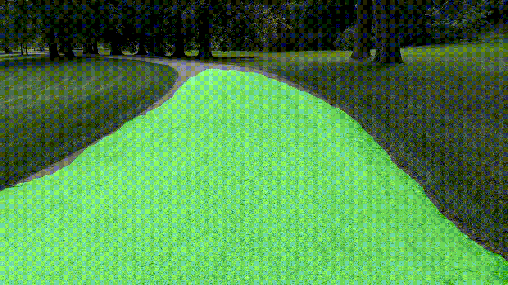

# DDRNet-23 Slim: Simple Project README

## Project Folders

- **data/** — your input images and masks.
- **experiments/** — configuration files (.yaml).
- **lib/** — neural network models and helpers.
- **demomy.py** — main script for running segmentation.
- **requirements.txt** — list of needed Python packages.

## How to Start

1. **Install everything you need:**
   ```
   pip install -r requirements.txt
   ```

2. **Put your image or video in the `data/` folder** (or set the file path).

3. **Change settings in the YAML file** if needed (inside `experiments/`).

4. **Run segmentation:**
   ```
   python3 demomy.py
   ```

5. **You’ll get a road mask as a result.**

## Results

**Speed on GPU:**
- Big image (720×1280):  
  Pre-processing: 26 ms  
  Inference: 4.6 ms  
  Post-processing: 18 ms  
  Total: 48 ms per frame (~21 FPS)

- Smaller image (550×688):  
  Pre-processing: 19 ms  
  Inference: 4.7 ms  
  Post-processing: 13 ms  
  Total: 36 ms per frame (~27 FPS)

**Speed on CPU:**
- Same small image:  
  Pre-processing: 18–23 ms  
  Inference: 78 ms  
  Post-processing: 24–71 ms  
  Total: 120–172 ms per frame (6–8 FPS)




## How to Change the Model or Settings

- Change the config file in `experiments/`.
- You can set image size, input files, or classes.

